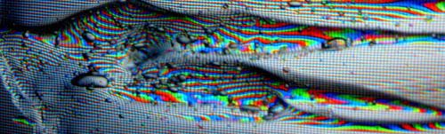

# INTRO TO DIGITAL VIDEO ART

#### .・゜:✧･ﾟ: *✧･ﾟ:* SJSU Art 75 | Spring 2019 *:･ﾟ✧*:･ﾟ✧
 

 #### ***[lectures](/lectures) - - - [readings](/readings) - - - [resources](/resources) - - - [tutorials](/tutorials)***

  ◇─◇──◇────◇────◇────◇────◇────◇─◇─◇
 

 

<!-- 🔍[Live site](https://art75.github.io/) with code samples and student net art gallery -->

 ***On this page:***
 * [Description](#-description)
 * [Resources](#-resources)
 * [Assignments](#-assignments)
 * [Grading Information](#-grading-information)
 * [Code of Conduct](#-code-of-conduct)

 

| Instructor 🤓 | Syllabi 🎳 |
| -------------------------- | ----------------- |
| ***Lark Alder***   **Office Location:** Art 323   **Office Hours:** Tuesdays 2-3:30pm or by appointment   **Email:** lark.buckingham@sjsu.edu   |   [Section 4 Syllabus PDF](resources/files/Syllabus_Alder_ART75_section4_Spr19.pdf)   [Section 5 Syllabus PDF](files/Syllabus_Alder_ART75_section5_Spr19.pdf)

 

# ▼△▼△▼ Description
This studio workshop course is an in-depth study of video as an art form in the context of Digital Media Art. We will look at trends in Video Art History through the lens of our current cultural and technological moment. For example, how do surveillance, Internet culture, social media, and new video recording technologies inform Video and New Media art practices? Projects will encourage students to take a critical approach to defining characteristics of video and related technologies. Students will explore various platforms for showing digital video art, including single- and multi- channel video, installation, social media, and interactive websites. Artistic voice is emphasized over technical skills.   

# ▼△▼△▼ Resources
This is the Github page for the class! We will also be using Canvas for submitting assignments, but will be posting all lecture notes and tutorials here. The [resources page](resources) includes a few useful files and a long list of handy links.   

Refer to the [tutorials index page](tutorials) for a quick reference to tutorials covered in the course.

# ▼△▼△▼ Assignments

Assignments overview, detailed below:

1.	Feb 4 - Single shot assignment 2%
2.	Feb 11 - 5-shot assignment 2%
3.	Feb 20 - Project 1: Video Art 2.0.19 15%
4.	Feb 25 - Go to an art show! (& blog response) 2%
5.	Mar 4 - Portfolio Live 5%
6.	Mar 11 - Project 2: Video as installation 15%
7.	Mar 18 -  HTML/CSS Net Art Assignment 5%
8.	Mar 25 - P5 assignment 5%
9.	April 10 - Project: Critical Interactivity 15%
10.	April 17 - Final Project Proposal Assignment 3%
11.	May 6 - Final Project 25%
12.	May 16 - Portfolios and Artist Statements 10%

 

## ┍━━━☟ Projects ☟━━━┑

#### Project 1: Video Art 2.0.19
15% of grade

Make a video that is in dialogue with the history & trajectory of video art. Over the last 60 years, artists have used video and digital media as tools for challenging cultural norms, exploring personal identity, unpacking politics of representation, and experimenting with potential use (and misuse) of new technologies. Students may apply these trends to our current cultural moment — looking at video’s role in YouTube, social media, surveillance, sousveillance, and activism — or choose to create a non-narrative/abstract piece.

Requirements:
* Original footage - no found footage
* No music (tonal sound design okay)
* 2-5 minutes in total
* Vision for how this would be presented: ie. on Vimeo or YouTube, as a series of Instagram posts, in a gallery installation, for a theater environment, projected on a building, etc.

#### Project 2: Video as Installation
Create video for a gallery environment. How might video create an immersive environment, integrate with sculpture, have multiple channels playing simultaneously, accompany performance, or incorporate live feeds of the room? This could be an installation involving projection mapping, sculpture, performance, multi-channel video, etc.

Requirements:
* Original footage - no found footage
* No music (tonal sound design okay)
* Minimum 2 minutes video
* Vision for installation experience
* Presentation of props, models, and/or designs for installation if not physically possible

#### Project 3: Critical Interactivity
What does it mean when the viewer is no longer a passive viewer, but an active participant in their interaction with the piece? This is browser-based (Net Art) using HTML/CSS and/or JavaScript with the P5.js library. It is preferable, but not required, that video is included in the site. ** This project can be built off of either the HMTL/CSS or the P5 Assignments **

Requirements:
* Strong concept driving the interaction
* Creative / critical / expressive use of the technology
* Interactive web page in place for critique

#### Final Project
Create a polished video art project. Students may either build on any of the previous projects or create a new project. The final project should be more advanced in concept and form than previous projects, reflecting student growth over the semester. Any topic or technique covered is acceptable.

Requirements:
* More sophisticated execution of learned techniques

 
 

## ┍━━━☟ Exercises/Assignments ☟━━━┑

*There will be regular technical- or writing-based exercises completed in class over the course of the semester. Completion of these assignments is essential to learning the skills necessary to complete the class projects.*

 
#### Single shot assignment

2% of grade

Using a DSLR camera, create a single, expressive shot that is 20-60secs in length. You may explore techniques in camera movement, rack focus, zoom, and various depths-of fields. Tripods are optional, but might be necessary depending on the content of your shot. This is an exercise in working with DSLR cameras. ** We will have time in class to shoot **

#### Five-shot assignment

2% of grade

Using a DSLR camera OR HD video recording on a smart phone, create a short video with FIVE SHOTS (no more, no less) that is between 30sec and 2min in length. This is an exercise to get acquainted with Premiere. ** We will have time in class to edit **

#### Go to an art show! (and blog response)

2% of grade

Go to a gallery, museum, or art show where video is present in some form. I will provide a list of suggested shows. You will need to turn in a ticket stub OR take a selfie of yourself at the show. A one-page blog response is also required, commenting on your experience.

#### HTML/CSS Net Art Assignment

3% of grade

Create an expressive, critical, or all-out weird use of a webpage. This is an exercise to work with HTML/CSS. ** We will have tutorials and in-class lab time for this assignment, and it may be the base for your Critical Interaction Project. **

#### P5 Assignment

3% of grade

Experiment with the P5.js library for JavaScript. This will include some kind of movement and/or interaction.  ** We will have tutorials and in-class lab time for this assignment, and it may be the base for your Critical Interaction Project. **

#### Final Project Proposal Assignment

3% of grade

Write a proposal for your Final Project and present it to the class for feedback.

 
 
## ┍━━━☟ Portfolio Website and Artist Statements ☟━━━┑

*Students will create or add to an existing artist portfolio site on GitHub, improving use of HTML/CSS and approaches to documentation. This will also include an artist statement that speaks to your general approach to your work. A portfolio is required for applying to the DMA BFA program. IT IS REQUIRED THAT YOU APPLY TO THE PROGRAM WHILE IN ART 75. APPLICATION DEADLINE IS (approx.) THE TENTH WEEK OF THE SEMESTER.*
 

#### Website live

5% of grade

Your website is live on GitHub, with a skeletal structure for your project gallery and artist statement. If you have already made a website in GitHub in Art 74, you may continue to use that one. If you have a website in another platform (ie. wix or squarespace), you will need to create one in GitHub specific to this class.

#### Portfolios and Artist Statements

5% of grade

Students will submit an artist portfolio site documenting the projects created in this class. This will include short descriptions for each project and a 2-paragraph artist statement that speaks to your general approach to your work.

  
# ▼△▼△▼ Grading Information

*	All assignments must be presented on the due date. **Late assignments will be accepted no more than 2 weeks after the due date, but with a letter grade reduction each week they are late and no class critique.**
* Students must be present for project critiques: critiques are not optional.
* All projects are evaluated based on their conceptual content, technical proficiency, and presentation according to the grading rubric provided below.

#### *Assignment Percentages for total grade:*

#### 70% - Projects

Project 1: Video Art 2.0.19 - 15%  

Project 2: Video as Installation - 15%

Project 3: Critical Interactivity - 15%

Final Project – 25%

#### Exercises/Assignments

Single shot assignment - 2%

5-shot assignment - 2%

Go to an art show! (& blog response) - 2%

HTML/CSS Net Art Assignment - 3%

P5 assignment - 3%

Final Project Proposal Assignment - 3%

#### 15% - Web Development, Documentation &amp; Portfolio

Website live – 5%
20
Portfolio with project documentation, short descriptions, and artist statement — 10%

  

## ▼△▼△▼ Grading Rubric
**All projects are evaluated based on their conceptual content, technical proficiency, and presentation according to the criteria provided below. Grading rubrics will be created based on learning objectives for each assignment**   

| A: Excellence                                                                                                                                                                                                                                                                                                                                                                                                                                                                      | B: Above Average                                                                                                                                                                                                                                                                                                                                                                                                                                                              | C: Average                                                                                                                                                                                                                                                                                                                              | D: Below Average                                                                                                                                                                                                                                                                                                                                                                                                  |
|------------------------------------------------------------------------------------------------------------------------------------------------------------------------------------------------------------------------------------------------------------------------------------------------------------------------------------------------------------------------------------------------------------------------------------------------------------------------------------|-----------------------------------------------------------------------------------------------------------------------------------------------------------------------------------------------------------------------------------------------------------------------------------------------------------------------------------------------------------------------------------------------------------------------------------------------------------------------------------|--------------------------------------------------------------------------------------------------------------------------------------------------------------------------------------------------------------------------------------------------------------------------------------------------------------------------------|-------------------------------------------------------------------------------------------------------------------------------------------------------------------------------------------------------------------------------------------------------------------------------------------------------------------------------------------------------------------------------------------------------------------|
| The student fully commits to their project, both conceptually and technically. The final work created not only meets the criteria but it exceeds it. The student demonstrates a full understanding of the course content, and is able to apply that understanding in making original work with their own personal style.                                                                                            | The student shows an understanding of the expected criteria for the assignment, and a sincere attempt to engage the conceptual framework. The quality of the project is good but not stellar. Technical understanding is demonstrated but has room for improvement.  | The student demonstrates a limited understanding of the conceptual framework of the assignment, and/or technical execution is underdeveloped with issues that could have been addressed in class or during office hours. The work would improve if more time and/or attention was dedicated to the project. | The student only shows the slightest understanding of the intent of the assignment. There is a general failure to follow the intent and nuance of the assignment. The project can only be described as something that needs a great deal of work before it is considered something that is complete and meeting the requirements.   |

 
 

# ▼△▼△▼ Code of conduct

*We will work together in the first week of class to draft a list of community agreements for the class*

## Section 4

* Take a 15 minute break at 1:30
* Start on time, but be patient if Lark has to set stuff up
* Don't interrupt people
* You can snack but be mindful of sound and personal space
* Listening to music in Lab is okay, but not other times
* Have positive feedback as well as constructive criticism
* No stealing
* Don't text during critique
* Be open to people having different perspectives
* Have fun
* Don't be afraid to ask for help
* Be respectful of other people's space
* No fighting - no physical violence
* Be sensitive to others needs
* Take space, leave space
* Ouch, oops, educate

## Section 5
* Be respectful - don't interrupt eachother
* Break for 15 min at 10:30
* Be open-minded - be sympathetic of other perspectives
* Be comfortable with silence, people might need time to collect thoughts
* Take space, leave space
* We are accepting of language difference
* Be on time
* End on time
* Don't come to class sick
* If you need help, don't be afraid to ask
  - Ask the person next to you
* Take care of yourself, go to the bathroom if you need to!
* Be friendly
* Mind your manners
  - courtesy - please / thank you
  - respect personal space - ask before touch
  - mind open beverage containers
* Be as creative as you can, no right or wrong answers
  - Think outside of the box
* Address ideas not the person
* Ouch, oops/educate

*
